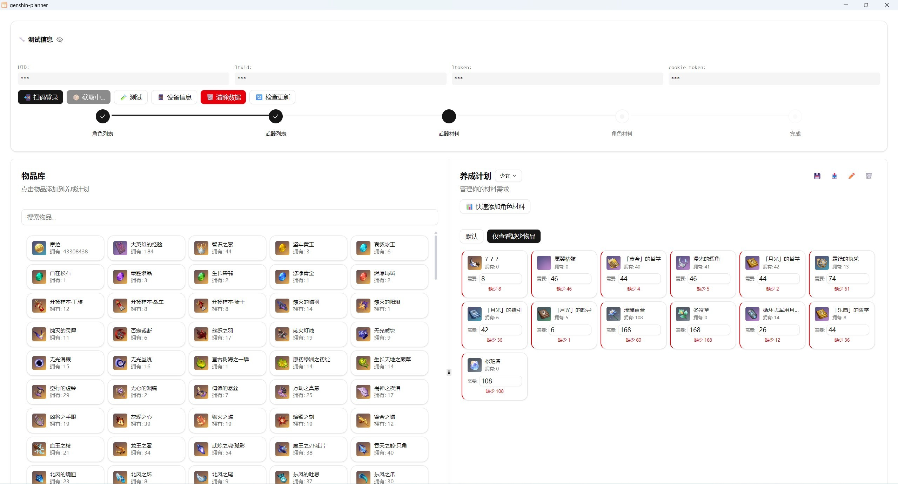

<h1 align="center">🎮 Genshin Planner</h1>

<p align="center">
  <strong>原神养成规划工具 · 材料计算 · 米游社扫码登录</strong>
</p>

<div align="center">
  
</div>
<br>

<div align="center">
  <a href="https://github.com/bling-yshs/genshin-planer/stargazers"></a>
  <a href="https://github.com/bling-yshs/genshin-planer/releases/latest"></a>
  <a href="https://github.com/bling-yshs/genshin-planer/releases"></a>
  <a href="https://github.com/bling-yshs/genshin-planer/blob/main/LICENSE"></a>
</div>
<br>

## 📥 下载安装

| 下载渠道 |
|:---:|
| [](https://github.com/bling-yshs/genshin-planer/releases/latest) |
| [![CNB](https://img.shields.io/badge/CNB-FF6200?logo=data:image/svg+xml;base64,PHN2ZyB3aWR0aD0iMzIwIiBoZWlnaHQ9IjMyMCIgdmlld0JveD0iMCAwIDMyMCAzMjAiIGZpbGw9Im5vbmUiIHhtbG5zPSJodHRwOi8vd3d3LnczLm9yZy8yMDAwL3N2ZyI+CjxwYXRoIGQ9Ik0yMjguOTA2IDQwLjI0MTJDMjI5Ljg4MiAzNy41MTA4IDIyOC45MDYgMzQuMzkwMyAyMjYuNzU5IDMyLjQ0QzIxOS4zNDIgMjYuMDA0IDIwMC43OTkgMTIuMzUxOSAxNzMuMDgyIDEwLjQwMTZDMTQxLjg1MiA4LjA2MTIxIDEyMi41MjggMTYuNDQ3NSAxMTIuNzY5IDIyLjY4ODVDMTA4LjQ3NCAyNS40MTg5IDEwOC4yNzkgMzEuNDY0OSAxMTIuMTgzIDM0LjM5MDNMMTkxLjYyNSA5Ni4yMTQ5QzE5OC42NTIgMTAxLjY3NiAyMDguOTk3IDk4LjU1NTMgMjExLjcyOSA5MC4xNjlMMjI4LjcxMSA0MC4yNDEySDIyOC45MDZaIiBmaWxsPSIjZmZmIi8+CjxwYXRoIGQ9Ik0zMi45MzgxIDIyMy41NjRDMjkuNjE5OSAyMjUuNzEgMjguMjUzNiAyMjkuODA1IDI5LjIyOTUgMjMzLjUxMUMzMi4xNTczIDI0NC40MzIgNDEuMzMxMiAyNjYuODYxIDY2LjkwMDkgMjg3LjUzNEM5Mi40NzA2IDMwOC4wMTIgMTIyLjcyNSAzMTAuMzUzIDEzNS42MDcgMzA5Ljk2M0MxMzkuNTExIDMwOS45NjMgMTQyLjgyOSAzMDcuNDI3IDE0NCAzMDMuNzIyTDE5NC45NDUgMTQyLjYyN0MxOTguNjUzIDEzMC45MjUgMTg1LjU3NiAxMjEuMTczIDE3NS40MjYgMTI3Ljk5OUwzMi45MzgxIDIyMy41NjRaIiBmaWxsPSIjZmZmIi8+CjxwYXRoIGQ9Ik03MC4yMTY5IDUzLjQ5NTVDNjcuNjc5NCA1Mi41MjAzIDY0Ljk0NjggNTIuNzE1MyA2Mi42MDQ1IDUzLjg4NTVDNTMuMjM1NSA1OC45NTYzIDI5LjAzMiA3NC43NTM4IDE2LjU0IDEwNy4zMjRDNi43ODA1NCAxMzIuMjg4IDEwLjA5ODcgMTU5Ljk4MiAxMi44MzE0IDE3My40MzlDMTMuNjEyMSAxNzcuOTI1IDE4LjI5NjcgMTgwLjQ2IDIyLjU5MDggMTc4LjcwNUwxNzUuNDI0IDExOS4wMjZDMTg2LjM1NCAxMTQuNzM1IDE4Ni4zNTQgOTkuMzI3NiAxNzUuNDI0IDk1LjAzNjlMNzAuMjE2OSA1My40OTU1WiIgZmlsbD0iI2ZmZiIvPgo8cGF0aCBkPSJNMjk3LjAzIDE2OC45NjhDMzAxLjUxOSAxNzEuODkzIDMwNy41NyAxNjkuMzU4IDMwOC4zNTEgMTY0LjA5MkMzMTAuMzAzIDE1MC4wNSAzMTIuMDYgMTI1Ljg2NiAzMDQuMDU3IDEwNy4zMzhDMjkzLjMyMSA4Mi45NTkxIDI3NC45NzQgNjcuNzQ2OCAyNjYuMTkgNjEuNzAwOEMyNjMuNDU4IDU5Ljc1MDUgMjU5Ljc0OSA1OS45NDU2IDI1Ny4yMTIgNjIuMjg1OUwyMTguNTY0IDk2LjQxNjJDMjEyLjMxOCAxMDIuMDcyIDIxMi45MDQgMTEyLjAxOSAyMTkuOTMxIDExNi42OTlMMjk3LjAzIDE2OC45NjhaIiBmaWxsPSIjZmZmIi8+CjxwYXRoIGQ9Ik0xODkuMDg5IDI5OS40MjhDMTg4LjY5OSAzMDMuOTE0IDE5Mi42MDMgMzA3LjgxNCAxOTcuMDkyIDMwNy4yMjlDMjExLjczMSAzMDUuNjY5IDI0MS43OSAyOTkuODE4IDI2NC4yMzcgMjc4LjM2NUMyODYuMDk4IDI1Ny40OTYgMjkzLjMyIDIzMi43MjggMjk1LjI3MiAyMjIuNzgxQzI5NS44NTggMjIwLjA1MSAyOTUuMjcyIDIxNy4zMiAyOTMuNTE1IDIxNS4xNzVMMjI1Ljk4IDEzMS44OTdDMjE4Ljc1OCAxMjIuOTI1IDIwNC4xMTkgMTI3LjQxMSAyMDMuMTQzIDEzOC45MThMMTg5LjA4OSAyOTkuMjMzVjI5OS40MjhaIiBmaWxsPSIjZmZmIi8+Cjwvc3ZnPgo=&logoColor=white)](https://cnb.cool/bling-team/genshin-planer/-/releases/latest) |

## ✨ 项目简介

Genshin Planner 是一个使用 Tauri v2 构建的原神养成规划桌面应用，帮助玩家高效管理角色和武器的升级材料。支持通过米游社扫码登录，自动计算所需材料，让养成规划更加便捷。

## 🚀 功能特性

- 🔐 **米游社扫码登录** - 支持米哈游官方扫码登录，安全便捷
- 👤 **角色材料计算** - 自动计算角色升级、天赋所需材料
- ⚔️ **武器材料计算** - 自动计算武器突破所需材料
- 📋 **养成计划管理** - 支持保存、切换多套养成计划
- 📦 **背包物品同步** - 支持同步游戏内背包物品数据
- 💾 **数据持久化** - 本地存储，数据不丢失
- 🔄 **自动更新** - 应用内自动检测并更新

## 🖼️ 应用截图

<div align="center">
  
</div>

## 🛠️ 技术栈

| 类型 | 技术 |
|:---:|:---:|
| 🖥️ 前端框架 | Vue 3.5 + TypeScript |
| 🎨 样式方案 | Tailwind CSS 4 |
| 📦 状态管理 | Pinia 3 |
| ⚡ 构建工具 | Vite 8 |
| 🦀 桌面框架 | Tauri 2 (Rust) |
| 📦 包管理器 | pnpm |

## 📂 项目结构

```
genshin-planer/
├── src/                        # 📱 Vue 源码
│   ├── main.ts                 # 🚀 应用入口
│   ├── App.vue                 # 🏠 主应用组件
│   ├── components/             # 🧩 UI 组件 (shadcn-vue)
│   ├── entity/                 # 📦 数据实体
│   ├── service/                # 🌐 API 服务层
│   ├── store/                  # 💾 状态管理
│   └── utils/                  # 🔧 工具函数
├── src-tauri/                  # 🦀 Tauri/Rust 代码
│   ├── src/                    # Rust 源码
│   └── tauri.conf.json5        # Tauri 配置
├── resource/                   # 🎨 资源文件
│   └── app-icon.svg            # 应用图标
└── .github/                    # 🔄 GitHub Actions
    └── workflows/              # CI/CD 工作流
```

## 🔨 开发指南

### 环境要求

| 环境 | 版本要求 |
|:---:|:---:|
| 🟢 Node.js | 24 |
| 📦 pnpm | 10 |
| 🦀 Rust | 现代版本即可 |

### 本地开发

```bash
# 📦 安装依赖
pnpm install

# 📱 启动 Tauri 开发模式
pnpm tauri dev

# 🔍 代码检查
pnpm lint

# 🏗️ 构建生产版本
pnpm tauri build
```

## 🤝 贡献指南

欢迎提交 Issue 和 Pull Request！

## 📄 许可证

本项目采用 [GPL-3.0](LICENSE) 开源许可证。
